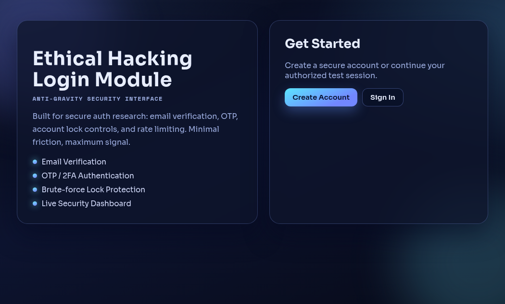
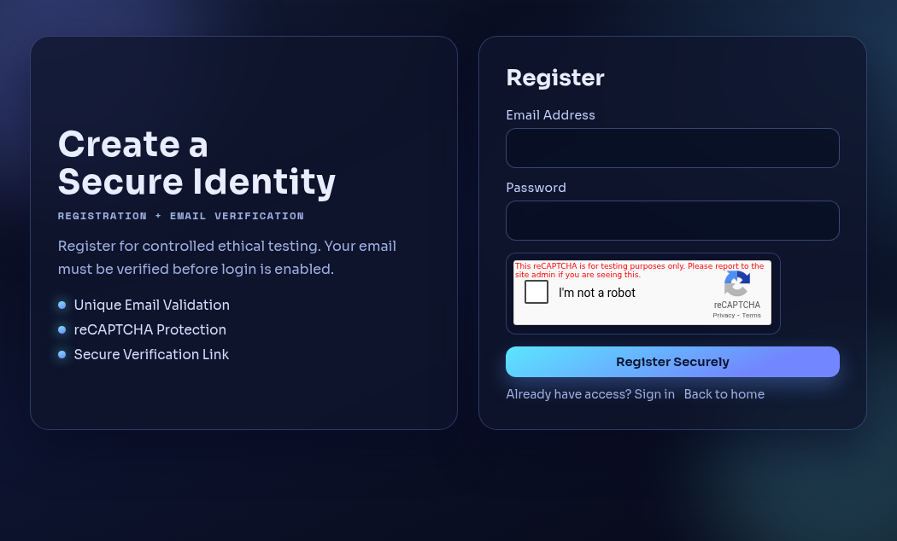
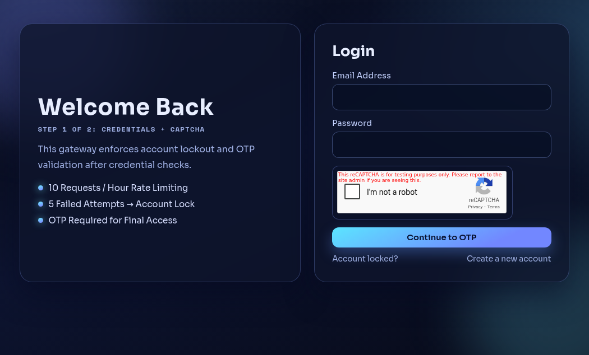
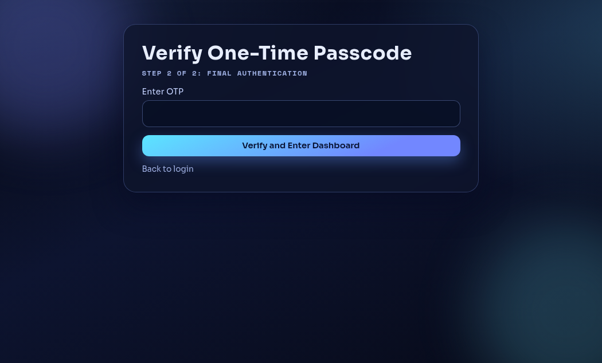
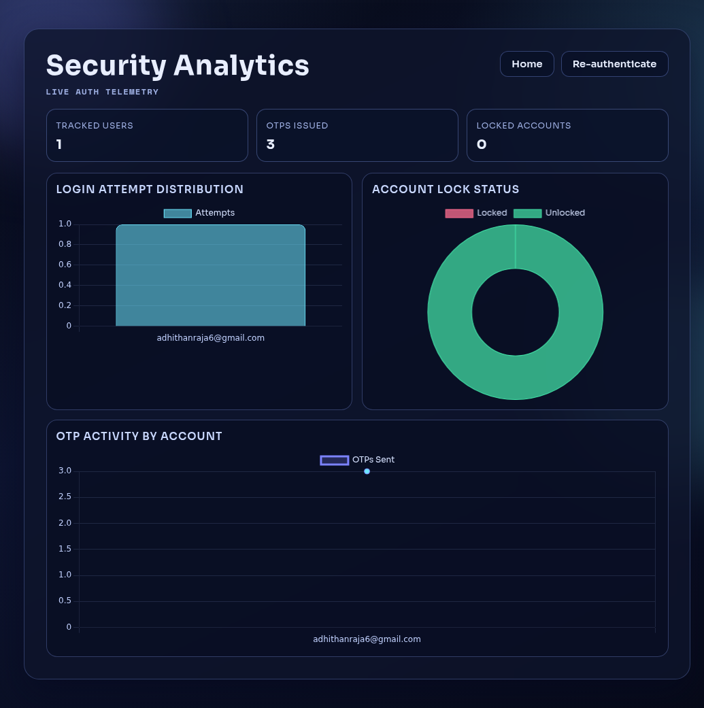
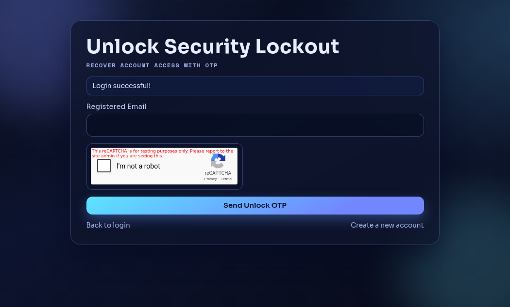

# Ethical Hacking Login Module (Flask)

A security-focused authentication module built for ethical testing and learning.

## Highlights

- Email verification before first login
- reCAPTCHA on sensitive auth forms
- OTP-based second-factor login
- Account lock after repeated failed attempts
- OTP-based account unlock flow
- Login rate limiting
- Security analytics dashboard (Chart.js)
- Modern anti-gravity themed UI

## Tech Stack

- **Backend:** Python, Flask
- **Security:** Flask-Limiter, reCAPTCHA, OTP via email
- **Database:** SQLite (`users.db`)
- **Frontend:** Jinja templates + custom CSS
- **Charts:** Chart.js

## Project Structure

```text
ethical-hacking-login-module-python/
├── app.py
├── requirements.txt
├── .env.example
├── README.md
├── static/
│   └── style.css
├── templates/
│   ├── index.html
│   ├── register.html
│   ├── login.html
│   ├── verify_otp.html
│   ├── unlock.html
│   ├── verify_unlock_otp.html
│   └── dashboard.html
└── docs/
    └── screenshots/
        ├── 01-home.png
        ├── 02-register.png
        ├── 03-login.png
        ├── 04-verify-otp.png
        ├── 05-dashboard.png
        └── 06-unlock.png
```

## Environment Variables

Create `.env` from `.env.example`:

```bash
cp .env.example .env
```

Set values:

```env
EMAIL_SERVICE=smtp.gmail.com
EMAIL_USER=your-email@gmail.com
EMAIL_APP_PASSWORD=your-app-password
EMAIL_FROM=Your Name <your-email@gmail.com>
RECAPTCHA_SITE_KEY=your-site-key
RECAPTCHA_SECRET_KEY=your-secret-key
PORT=5000
DEV_MODE=false
```

## Run Locally

```bash
python3 -m venv venv
source venv/bin/activate
pip install -r requirements.txt
python app.py
```

Open:

- Home: `http://127.0.0.1:5000/`
- Register: `http://127.0.0.1:5000/register`
- Login: `http://127.0.0.1:5000/login`
- Unlock: `http://127.0.0.1:5000/unlock`
- Dashboard: `http://127.0.0.1:5000/dashboard`

## Authentication Flow

1. User registers with email, password, and reCAPTCHA
2. System sends verification email
3. User verifies email via link
4. User logs in with email/password + reCAPTCHA
5. System sends OTP to email
6. User enters OTP and accesses dashboard
7. After repeated failed logins, account is locked
8. User unlocks via unlock OTP flow

## Security Controls

- Email verification gate
- reCAPTCHA checks on register/login/unlock
- OTP verification before session login
- Failed attempt tracking + lock threshold
- Unlock OTP recovery
- Login endpoint rate limit (`10/hour`)

## Screenshots

### Home


### Register


### Login


### Verify OTP


### Dashboard


### Unlock


You can also download all screenshots as a bundle:
- `docs/screenshots_bundle.zip`

## Documentation

Complete end-to-end technical documentation is available in:

- `Ethical_Hacking_Login_Module_E2E_Documentation.docx`

(Generated via Word MCP and includes architecture, route mapping, security review, QA checklist, and embedded screenshots.)

## Important Notes

- This project is for **ethical/security learning and controlled environments**.
- For production use, implement:
  - password hashing (bcrypt/argon2)
  - signed/expiring verification tokens
  - OTP expiration + one-time invalidation
  - CSRF protection
  - secure cookie/session settings
  - production WSGI deployment and HTTPS
